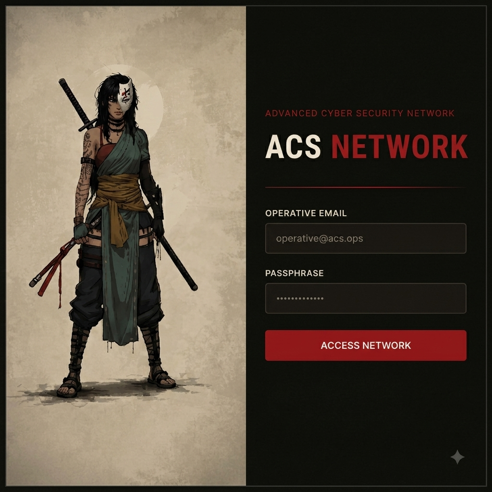

# ACS Secure Net




**ACS Secure Net** is a purpose-built Security Testing Platform for practicing **Insecure Direct Object Reference (IDOR)** vulnerabilities across 10 categories and 18 endpoints.

---

## 🚀 Quick Setup (Docker)

### Option 1: Docker Compose (Local Build)

```bash
git clone https://github.com/S4MC71/acs-secure-net.git
cd acs-secure-net
docker-compose up -d --build
```

### Option 2: Run directly from GitHub Server (GHCR)

```bash
docker run -d -p 8888:3000 --name acs-secure-net ghcr.io/s4mc71/acs-secure-net:latest
```

Access the application at `http://localhost:8888`.

---

### 🔄 Updating to Latest Version

If you pushed new changes to GitHub/GHCR and want to pull & run the updated version locally:

#### Method A: GHCR Image Update
```bash
# 1. Stop and remove the old container
docker rm -f acs-secure-net

# 2. Pull the latest image from GHCR
docker pull ghcr.io/s4mc71/acs-secure-net:latest

# 3. Start the container with the updated image
docker run -d -p 8888:3000 --name acs-secure-net ghcr.io/s4mc71/acs-secure-net:latest
```

#### Method B: Local Code Update (Docker Compose)
```bash
# 1. Pull latest code from git
git pull origin main

# 2. Rebuild and restart container
docker-compose down
docker-compose up -d --build
```

---

## 🎯 Vulnerability Coverage

| ID | Category | Description |
|---|---|---|
| **I1** | **Numeric ID** | Sequential integer identifiers (`/api/agents/1`). |
| **I2** | **UUID** | Universally Unique Identifiers (`/api/missions/uuid/...`). |
| **I3** | **PII (Phone)** | Phone number lookups (`/api/agents/phone/...`). |
| **I4** | **PII (Email)** | Email address lookups (`/api/agents/email/...`). |
| **I5** | **Username** | Username path lookups (`/api/agents/u/...`). |
| **I6** | **Slug-based** | URL slugs (`/api/intel/...`). |
| **I7** | **Composite IDOR** | Multi-attribute auth bypass (`/api/verify/...`). |
| **I8** | **File Path** | Arbitrary file read (`/api/files/read?path=...`). |
| **I9** | **Encoded Ref** | Base64, Hex, URL-encoded references. |
| **I10** | **Hashed Ref** | Enumerable MD5 / SHA1 hashes. |
| **I11** | **Token-based** | Predictable magic links, reset tokens, QR codes. |

---

## 🎮 How to Audit

1. **Login:** Log in with default recruit credentials (`yaw@acs.ops` / `Yaw@2025`).
2. **Reconnaissance:** Inspect API requests in Browser Developer Tools (Network tab).
3. **Exploit:** Manipulate parameters and identifiers to access unauthorized dossiers.
4. **Retrieve Secrets:** Each successful exploit reveals a secret token formatted as `ACS_SECURE{...}`.

---

## ⚠️ Disclaimer

Educational and ethical security testing purposes only.

**Organization:** ACS Secure Net


